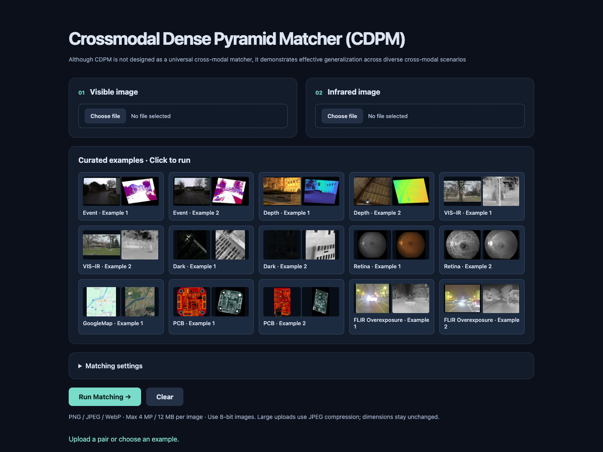
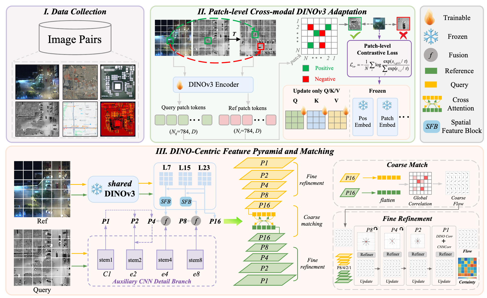
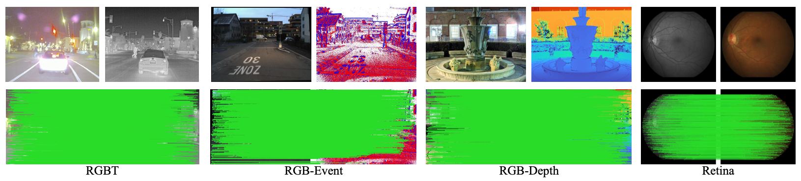

# CDPM

Official repository for **Geometry-Aligned Semantic Matching for Cross-Modal Planar Registration**.

CDPM establishes dense cross-modal correspondences for accurate planar registration.

[Project Page](https://warren-wzw.github.io/CDPM/) · [Online Demo](https://huggingface.co/spaces/Warren-wzw/CDPM) · [Dataset](#dataset)

<p align="center">
  
  
</p>


## Online Demo

Try an example or upload your own image pair in our [Hugging Face Space](https://huggingface.co/spaces/Warren-wzw/CDPM).

[](https://huggingface.co/spaces/Warren-wzw/CDPM)

## Method

CDPM combines geometry-aligned DINOv3 features with a DINO-centric feature pyramid, using auxiliary CNN details for precise localization.




## Generalization

Trained on GoogleMap, CDPM transfers to unseen cross-modal image pairs without fine-tuning.



## Dataset

**PCB–Layout** pairs real PCB images with design layouts, providing 3,000 training pairs and 500 test pairs with a split by PCB surface.


Download link coming soon.

## Citation

If you find CDPM useful, please cite:

```bibtex
@article{wang2026cdpm,
  title={Geometry-Aligned Semantic Matching for Cross-Modal Planar Registration},
  author={Wang, Zhiwei and He, Defeng and Li, Yuxing and Zhu, Meilu and Lam, Edmund Y.},
  year={2026}
}
```